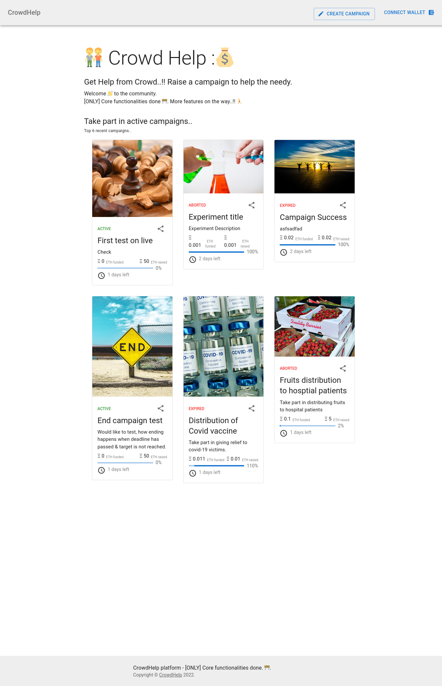
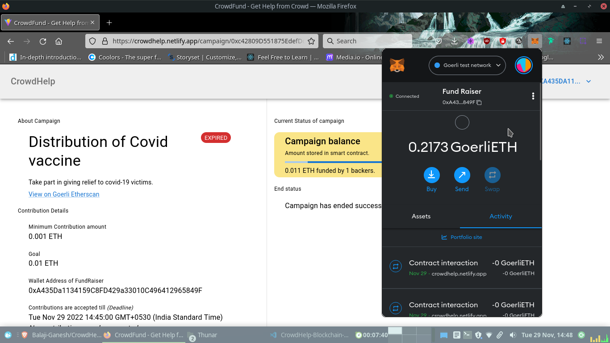

# Index - _What's in this?_

- [Current status of Project](#current-status-of-the-project-)
- [**Application Features**](#-application-features-)
  - [Currently implemented](#currently-implemented-)
  - [Planned in next versions](#kept-for-next-version-)
- [**How the application works?**](#understanding-application-flow)
  - [Terminology used](#understanding-the-terminology-used-)
  - [How the application works?](#understanding-the-flow-of-application-with-screenshots-)
    flow of ...
    1. Wallet connection
    2. Campaign Creation & Display
    3. Contributing funds
    4. Ending Campaign
    5. Aborting Campaign
    6. Viewing campaign's transaction on etherscan.io
- [**Ingredients of recipe**](#ingredients-of-recipe) _(here, recipe refers to application)_
  - [Key ingredients](#packages-used-)
  - [Tools to prepare](#tools-used-%EF%B8%8F)
- [**Running on your own**](#how-to-run-locally--remotely-%EF%B8%8F)
  - [Pre-requisites to run](#pre-requisites-%EF%B8%8F)
  - [Running locally](#running-locally-with-hardhat-%EF%B8%8F)
  - [Running remotely](#running-remotely-%EF%B8%8F)
- [**Crucial components of implementation - References**](#references-taken-)
  - [Getting the gist](#for-understanding-of-crowdfunding-idea-with-blockchain--developing-smart-contract)
  - [Making the recipe](#for-implementation-)
- [Resources you can use](#docs--reports-)
- [Acknowledgements](#acknowledgements)

## Current Status of the project 📃

- Application is deployed on Netlify _(for frontend)_ and Infura _(Goerli test network)_ with essential features _(listed below)_.
- Please checkout at [here](https://crowdhelp.netlify.app). Found any bugs? or felt like need some features -- please feel free to raise a new issue or submit your pull request.
- **Thanks** for your time in looking into this project.

# ✨ Application features ✨

## Currently implemented 💡

|              **Feature** | **User**             | **Explanation**                                                                                                                                                                                                                   |
| -----------------------: | -------------------- | --------------------------------------------------------------------------------------------------------------------------------------------------------------------------------------------------------------------------------- |
|    **Wallet connection** | Fund raiser / backer | Whether campaign creation / contributing funds or any action related (except viewing) needs wallet connection & authorization at each crucial step for providing strong security.                                                 |
|    **Campaign Creation** | Fund Raiser          | A campaign to raise funds for a cause. Creator has to fill few mandatory details like `title`, `description`, `image-URL` (for displaying as a banner), `minimum contribution amount`, `target amount`, `deadline` (date & time). |
| **Displaying campaigns** | Any user             | Displays list of campaigns in the home page, where each campaign will be displayed as a card & current status is displayed as a progress bar. Upon clicking campaign-specific page will be displayed.                             |
|         **Fund raising** | Backers              | A backer can support to a campaign by raising atleast minimum amount _(as set at the time of campaign creation)_. Contributed amount will be stored in the smart contract until the project end.                                  |
|       **Abort campaign** | Fund raiser          | Fund raiser can abort campaign (before deadline) - with whatsoever may be the reason. In this case, all the raised funds (if any) will be payed back to backers.                                                                  |
| **Ending & withdrawing** | Fund raiser          | Fund raiser can end the campaign [ONLY] after the deadline & campaign has reached its goal. Else they need to abort to pay back to backers.                                                                                       |

## Kept for next version 💼

|                          **Feature** |    **User**     | **Purpose**                                                                                                                                                                                                                                                              |
| -----------------------------------: | :-------------: | ------------------------------------------------------------------------------------------------------------------------------------------------------------------------------------------------------------------------------------------------------------------------ |
|               **Setting Milestones** |   Fund raiser   | Has to set at time of campaign creation. <br/> **Why?** To protect the funds of backer. The money will be distributed in chunks by showing the progress of funds usage.                                                                                                  |
|           **Updating campaign page** |   Fund raiser   | To elaborate the cause.                                                                                                                                                                                                                                                  |
|        **Raising Withdraw requests** |   Fund raiser   | A request with amount needed and reason. <br/> **Why?** the funds raised of backers. The request will be approved only if > 50% of contributors accept it.                                                                                                               |
|      **Approving withdraw requests** |     Backer      | Depending on the progress achieved by campaign & amount needed, he can approve request. <br/>NOTE: Any backer who has contributed >= Minimum amount will be considered as approver.                                                                                      |
|               **Contributions page** |     Backer      | A separate page, where backer can only view the campaigns they funded with the amount of contributions. <br/> **Why?** to facilitate how many campaigns they are supporting & to know **SPECIFIC** campaigns status to monitor how their contributed funds are in usage. |
|                      **Funds usage** | Backer / public | A page which shows the flow of funds (_Inflow:_ from backers, _Outflow:_ by fundraiser with a reason) with all the transaction IDs which can be checked publicly via [etherscan.io](https://etherscan.io)<br/>**Why?** to provide transparency.                          |
| **Searching campaigns with filters** |     Public      | (Mainly) to facilitate backers & public, to search for campaigns & know the status of it, usage of funds ... etc.,                                                                                                                                                       |
|        **Backers withdrawing funds** |     Backer      | This is still in question.                                                                                                                                                                                                                                               |

# Understanding application flow

## Understanding the terminology used ..

**Users of application**

|        **User** | **Explanation**                                                          |
| --------------: | ------------------------------------------------------------------------ |
|      **Public** | - Can be any one. This includes fundraisers, backers and general public. |
| **Fund Raiser** | - The one who creates the campaign to raise funds for a cause.           |
|      **Backer** | - The one who can contribute to the campaign.                            |

**of Campaign**

| **Term**  | **Meaning**                                                                                                                                                                                                              |
| --------- | ------------------------------------------------------------------------------------------------------------------------------------------------------------------------------------------------------------------------ |
| `ACTIVE`  | - Campaign has raised & running. <br/> - Hasn't reached the goal set. <br/> - Open for contributions.                                                                                                                    |
| `SUCCESS` | - Campaign has reached the goal set before the deadline. <br/> - Still, open to contributions.                                                                                                                           |
| `EXPIRED` | - Campaign has achieved `SUCCESS` stage and its deadline has expired. <br/> - No contributions are accepted now.                                                                                                         |
| `ABORTED` | - Campaign has raised, and its aborted in between, whether it might be in `SUCCESS` or `ACTIVE`. <br/> - In this case, all the raised funds will be returned back to backers. <br/> - No contributions are accepted now. |

Now, good to go.
Ready with understanding and basic setup.

## Understanding the flow of application (with screenshots) 📸

**Home page**


### **1. Wallet connection**

1. Click on **Connect Wallet** at top-right in navbar.
2. Select the accounts you would like to connect with the site.
   
3. Click on **Connect**
   

- Notice at the top-right of navbar, that showing connnected wallet's address instead of **Connect wallet** button. The user can click on it, to get option to disconnect the wallet.
  

### **2. Campaign Creation & displaying**

1. Click on **Create campaign** button at top-right in navbar.
2. Fill the details.
   
3. Authenticate with wallet.
   
4. After successful creation, navigates to the homepage that shows the newly created campaign.
   
5. [Page Appearance] When fundraiser clicks on the campaign which they had created. <br/> Notice that, both are of same addresses, the connected wallet address (at top-right) and in the _Wallet address of Fundraiser_.
   
6. [Page Appearance] When public/backer clicks on the campaign which others had created. <br/> Notice that, both are of different addresses, the connected wallet address (at top-right) and in the _Wallet address of Fundraiser_.
   

### **3. Contributing to campaigns**

1. Select the campaign you would like to fund/contribute.
2. Enter the amount >= minimum amount and click on **Contribute funds**. Click on **Confirm** to finish authentication with the wallet.
   
3. Status of contribution

- showing Success message after funding.
  
- Showing updated status (after closing the message, page gets reloaded).
  

### **4. Ending Campaign**

0. FundRaiser's wallet balance before ending the campaign.
   

1. After fundraiser clicks on **End Campaign & withdraw**, asking for wallet authentication. Noice that, the wallet balance has increased from `0.2065 ETH` to `0.2173 ETH`.
   
2. Fundraiser's wallet after successful end.
   

### **5. Aborting Campaign**

0. Backer's wallet balance before the fundraiser aborting the campaign.
   
1. Fund raiser clicking on Aborting campaign.
   
2. Fund raiser filling the reason for aborting and accepting the condition of refund to backers.
   
3. Fund raiser authenticating the transaction with the wallet.
   
4. Backer's wallet balance after fund raiser aborting the campaign. Notice that, the balance of backer has increased from `0.4396 ETH` to `0.5396 ETH`. <br/>
   After aborting, each backer will get their **whole** amount, even if they contribute partially multiple times.
   

### **6. Viewing [any] campaign's transactions**

1. Any user can view the campaign's transactions in [etherscan.io](https://goerli.etherscan.io) -- By clicking on **View on Goerli therscan** link on any campaign page.
   
2. This opens up a new page of `goerli.etherscan.io`, showing the transactions.
   

- This provides transparency and trust that,
  - When backer has funded, with what amount..
  - When did the campaign has ended, aborted...

# Ingredients of recipe

## Packages used 📦

|                                                               **Packages used** | **Purpose**                                                                                       |
| ------------------------------------------------------------------------------: | ------------------------------------------------------------------------------------------------- |
|                                                   [Vitejs](https://vitejs.dev/) | Fronted tool for fast bundling                                                                    |
|                                                         [MUI](https://mui.com/) | UI tool based on Google's [Material design](https://m3.material.io/) standards.                   |
|                     [Solidity v0.8.4](https://docs.soliditylang.org/en/v0.8.4/) | For writing the smart-contracts that can interact with the ethereum & ethereum-based blockchains. |
|                                             [hardhat](https://hardhat.org/docs) | Ethereum development environment                                                                  |
|                                     [ether.js docs](https://docs.ethers.io/v5/) | A compact library for interacting with the Ethereum Blockchain and its ecosystem.                 |
| [web3.js](https://www.npmjs.com/package/web3), [docs](https://docs.web3js.org/) | The ultimate JavaScript library for Ethereum                                                      |

## Tools used ⚒️

|                                                  **Tool** | **Used for**                                                                                         |
| --------------------------------------------------------: | ---------------------------------------------------------------------------------------------------- |
|                             [github](https://github.com/) | A Version control system, for managing different versions & issue tracking.                          |
|                 [VS code](https://code.visualstudio.com/) | An IDE, for writing code.                                                                            |
|                          [Prettier](https://prettier.io/) | A VSCode extension, for auto-formatting of code when saved.                                          |
|                           [gitmoji](https://gitmoji.dev/) | A git commit tool, to use emojis in commits.                                                         |
|                          [metamask](https://metamask.io/) | A digital wallet as a browser extension, to manage different test accounts & authorize transactions. |
| [**Firefox**](https://www.mozilla.org/en-US/firefox/new/) | Browser, for inspection of code with console.                                                        |
|                       [Netlify](https://www.netlify.com/) | For deploying frontend site.                                                                         |
|                          [Infura](https://www.infura.io/) | To deploy smart-contract to remotely in `Goerli` test network.                                       |
|                              [Yarn](https://yarnpkg.com/) | A package manager, to add & remove packages for the project as per need.                             |

# How to run _(locally & remotely)_? 🏃‍♂️

## Pre-requisites 🛠️

- Metamask wallet with some `GoerliETH`, fine even if had < 0.5 ETH _(for testing purposes)_.
  - Lacking GoerliETH ? -- get it free of 0.2 ETH/day at [Alchemy's Goerli faucet](https://goerlifaucet.com/) -- note that, this needs sign-up.
- Clone this repo.

_(ONLY for running remotely)_

- Create an account on [Infura](https://infura.io), can also be on [Alchemy](https://www.alchemy.com/). \_(This project used Infura with `goerli-testnet`)
- Create a new project & get an end-point of it.
- Create a new file with name `.env.local` in project's root directory.
- Store the API key as ..

  ```.env
  INFURA_API_KEY=<Your API_key here>
  PRIVATE_KEY=<Your private key>
  ```

**How to get Private key?** _(In metamask wallet)_

1. Open your metamask wallet and choose the account of which you need the private key.
2. Goto **Account Options** _(3 dots at top-right)_ → **Account Details**.
3. Now click on **Export private Key** and enter your metamask password.
4. Get this and paste in `.env.local` file as `PRIVATE_KEY`.

## Running locally _(with **hardhat**)_ 🏃‍♂️

_(Run these commands by being in project root directory)_

- Install the project dependencies
  ```sh
  yarn dev
  ```
- Run local hardhat network
  ```sh
  npx hardhat node
  ```
  _Make changes to the smart-contract if needed._
- Compile the smart contract via
  ```sh
  npx hardhat compile
  ```
- Deploy the smart contract
  ```sh
  npx hardhat run scripts/deploy.js --network localhost
  ```
- This outputs the message as..
  ```
  Contract deployed to address: <Hex_address>
  ```
- Paste this address at `utils/contract/crowdHelp.js` as value for `crowdHelpContractAddress` variable.

- Run the frontend
  ```sh
   yarn dev
  ```
  - This will run server on `127.0.0.1:5173`

## Running remotely 🏃‍♂️

- Follow the above steps. Now just change the network as `goerli_testnet` while deploying.
  ```
   npx hardhat run scripts/deploy.js --network goerli_testnet
  ```
- To run on different test-net..
  - Use different URL in `hardhat.config.js`.

# References taken ⚓

## for understanding of crowdfunding idea with blockchain & developing smart-contract

**Research papers** 📝

**Web references** 🕸️

## for implementation 🎬

_(Majorly...)_

1. [Betterfund - @harsh242](https://github.com/harsh242/betterfund-crowdfunding-in-blockchain)

   - for UI designs, smart-contract & connection.

2. [Crowdfunding-DAPP - @spandan114](https://github.com/spandan114/Crowdfunding-DAPP)

   - for upgrading the smart contract with latest version - v0.8.4.
   - running via `hardhat`, deploying locally & remotely.

3. [MUI](https://mui.com/)

   - their templates, for ready use & little customization.
   - for implementing various design components

# Docs & reports 📘

- Detailed Documentation PDF version - [_Earlier version_](https://drive.google.com/file/d/1k-kUZ3tw3iFYRNsqDxP8UjEcs0CnIu1K/view?usp=sharing), [_Latest with new changes_](https://drive.google.com/file/d/1AAaWbmMpCXoIaLle3ne3xcyUUrJ9TbNi/view?usp=sharing)
- PPTs - [Review_1 - Introduction, SRS & Literature Survey](https://drive.google.com/file/d/1pClPlQjDtnnx3ibsLzgpA3nKgT4GuNIh/view?usp=sharing), [Review_2- System Design, Use cases & Sequence diagrams](https://drive.google.com/file/d/1L1RBqO5CgtdZDzJoeR5TE6tjPZieNk8L/view?usp=sharing), Review\*3 - Implementation screenshots, conclusion & future upgrades _(Not prepared, but all these are available in this README.md)_ - [Final Viva - concised version](https://drive.google.com/file/d/1hGgSI76YmqfYDj6Ptt-tszw0HTcuZstd/view?usp=sharing) _(Almost similar to Review-3)_
- Design files - [done in app.diagrams.net _(formerly draw.io)_](https://drive.google.com/file/d/1Jc0BBMfM1klZfjZ2x4Wah0PLK0q1V8qP/view?usp=sharing)

# Acknowledgements

_(Specially)_

- Finally, to Omniscient, without whom, this project doesn't even reach this stage. All is **HIS** grace, nothing is mine.
